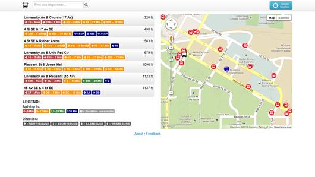

MSPBUS.ORG
==============================

Setup
==============================

 1. Download and install [ElasticSearch](http://www.elasticsearch.org/)
 2. Install Ruby 1.9.3
 3. Install Rails
   * Be sure that Rails is not trying to use Ruby 1.8, it will not work
 4. Install Bundle
 5. Run `bundle`
   * May need `sudo apt-get install libpq-dev`
   * May need `sudo apt-get install libsqlite3-dev`
 6. Start Elastic Search with `sudo service elasticsearch start`
 7. Configure **config/database.yml**
 8. rake db:migrate
 9. Load stop data into postgres `rake mspbus:load_stops`
 10. Index GeoData `rake environment tire:import CLASS='Stop' FORCE=true`
 11. Run `rails s` in the project's base directory to start the server

Database Stops Table
==============================
<pre>
       Column        |          Type          | Modifiers 
---------------------+------------------------+-----------
 stop_id             | character varying(500) | not null
 stop_code           | character varying(500) | 
 stop_name           | character varying(500) | not null
 stop_desc           | character varying(500) | 
 stop_lat            | numeric(9,6)           | not null
 stop_lon            | numeric(9,6)           | not null
 zone_id             | character varying(100) | 
 stop_url            | character varying(500) | 
 location_type       | integer                | 
 parent_station      | character varying(500) | 
 stop_timezone       | character varying(500) | 
 wheelchair_boarding | integer                | 
 stop_street         | character varying(500) | 
 stop_city           | character varying(500) | 
 stop_region         | character varying(500) | 
 stop_postcode       | character varying(50)  | 
 stop_country        | character varying(100) | 
Indexes:
    "stops_pkey" PRIMARY KEY, btree (stop_id)
</pre>

Example output

<pre>
 1000    |           | 50 St W & Upton Av S        | Near side E   | 44.912365 | -93.315178 |         | http://www.metrotransit.org/NexTripBadge.aspx?stopnumber=1000  |               |                |               |                   1 | 50 St W     | MINNEAPOLIS         |             |               | 
 10000   |           | Carmen Av & Claude Way E #2 | Across from S | 44.857449 | -93.040977 |         | http://www.metrotransit.org/NexTripBadge.aspx?stopnumber=10000 |               |                |               |                   1 | Carmen Av   | INVER GROVE HEIGHTS |             |               | 
 10001   |           | Carmen Av & 65 St E         | Far side S    | 44.855103 | -93.042496 |         | http://www.metrotransit.org/NexTripBadge.aspx?stopnumber=10001 |               |                |               |                   1 | Carmen Av   | INVER GROVE HEIGHTS |             |               |
</pre>
